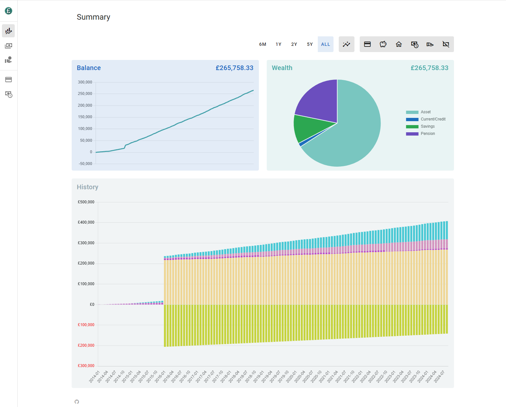
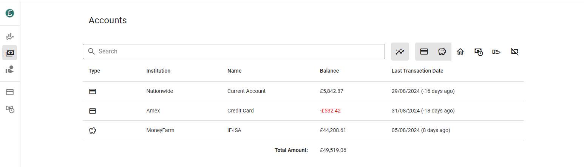
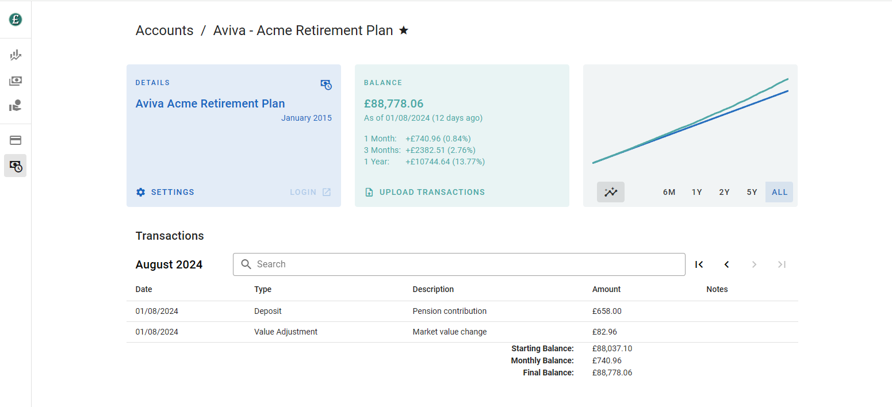

# Finances - By Isaac Norman

This readme is just a placeholder of enough info to know what this repo is and run it with sample data.

# About

I had a spreadsheet for a long time that I kept all my personal finances in.  It was good, but I always found it annoying to keep up to date, copying and pasting stuff in.  Also, with my excel skills at least, it didn't really scale well if I wanted to make a new visualisation or remap data.

I finally had a bit of time and thought I would kill two birds with one stone:  replace the spreadsheet with a nice app and also create a project that demonstrated my skills.

I have managed to create an app that should replace the spreadsheet.  However, it's taken a lot longer than I really had time for and it's the opposite of polished code I'd love to show off.  I'm mostly a backend developer and a LOT of this work was front end.  One day I'll make the code nice but that's not now, so no judging.

#### Summary Page

#### Accounts Page

#### Account Details Page

#### Taxable Income Page


# What does it do?

Basically you can ingest different data files - ofx, csv - and build up a database of accounts, transactions and data points (currently about job/salary/tax) and then view it all in a web front end.

## Features
- Summary Page
  - Balance over time
  - Wealth pie chart
  - Stacked account bar chart (accounts summed over time)
- Accounts Page
  - View all accounts and navigate to Account Details
- Account Details Page
  - List of monthly transactions (like on your banking app)
  - Balance over time
  - value vs contributions for account types that grow such as share ISAs, houses etc.
  - link to account login (i.e. your banking web page)
- Taxable Income Page
  - visualisations on tax, income, salary and career
- General Features
  - Interpolation of missing transactional data (i.e. if you only have the odd value of a pension/asset it will work out the missing values)
  - All filterable by account type and time range

### Supported formats
- ofx - tested with HSBC and Nationwide, use this if available
- csv - plain transactions when ofx not available:
```
"date","transaction_type","description","amount","notes"
"30/04/2024","","Opening Balance","123.45",
"01/05/2024","","CASH ATM MAY01","-20.00","Cash for barber"
```
- value_and_contrib_csv - for accounts that change in value (shares, property, etc).  Use this along with transaction rules and the UI will show line graphs comparing money in and account value (i.e. profit/loss):
```
"Date","Market value","Net contributions"
"2023-06-01","291.65","293.52"
"2023-07-01","590.36","587.04"
```
- crowd_property_csv - import the format provided by CrowdProperty
```
Date,Entry,From,To,Type,Amount,Reference,Transaction
```

# What is incomplete?
- The code is extremely prototype - was rushed to just get functional.
- Most of the ingest currently happens via python, the UI for this needs implementing
- Editing accounts and manually inputing transactions
- A proper packed build of the front and back end
- A proper docker image for the front and back end
- Tests are basically a skeleton.  They need writing around the sample data.
- Plus lots more

# What's the architecture?

Backend: Python FastAPI, SqlAlchemy, Pydantic, Alembic
Frontend: Vue 3, Vuetify 3, TypeScript
DB: Dockerised Postgres

# How do I run it?

## Docker
- check out the code
- make sure you have docker
- create a .env file in the base of the repo and put in
```
PGADMIN_DEFAULT_EMAIL=<email_addr>
PGADMIN_DEFAULT_PASSWORD=<password>
```
- run
```
docker compose up --build -d
```
- go to:
  - http://localhost:3000/ for the UI,
  - http://localhost:8000/documentation for the REST Swagger UI
  - http://localhost:8888/ for pgadmin (use the creds you made above to login then the db password is currently 'postgres')

## Source
- check out the code
- create a python venv and install the requirements.txt
- run the docker compose:
```
docker compose up -d
```
- initialise the db with alembic:
```
alembic upgrade head
```
- optionally load some sample data (recommend if you want to just give it a quick try)
```
python load_sample_data.py
```
- run the backend
```
fastapi dev backend/main.py
```
- install deps for the frontend
```
cd frontend
npm install
```
- run the frontend
```
cd frontend
npm run dev
```
- navigate to the frontend web address: http://localhost:3000/
- if you want to erase the db and start again
```
docker compose down db
docker volume rm finances_db
docker compose up db -d
```
# Sample Data

A quick word on sample data.  The sample data loaded by `load_sample_data.py` comes from `backend/test/sample_data_utils.py` which is (or will be) used to generate test data.  I made this so people could try the app and see if it appeals without loading their data first (or me having to show mine).  It's also a good place to look to understand what data is needed for the current visualisations.  In particular the data series that make the taxable income stuff and transaction rules.

## Transaction Rules

Transaction rules are one of the least obvious bits at the moment - a result of trying to be a bit future proof and flexible.  A transaction rule is applied per account and allows modifications to transactions based on the condition.

Currently the only rule/condition I have is for setting the value adjustment flag:

```
# if the transaction type column contains 'value adjustment'
# set the #is_value_adjustment field to true
# (see api_models.IsValueAdjContainsAny)
IsValueAdjContainsAny(
    values=["value adjustment"],
    read_col="transaction_type",
)
```

This is applied to my growth accounts (typically Share ISAs, Property, Pensions) and differentiates transactions that are adjusting the value due to growth from deposits and withdrawals.  This lets me show profit/loss in the UI.

In future I expect transaction rules to also do things like rules for tagging transaction categories (bills, leisure, etc).  The idea being if you have everything rule based then you don't have to worry about data decoration getting lost if you delete all your data and re-import.